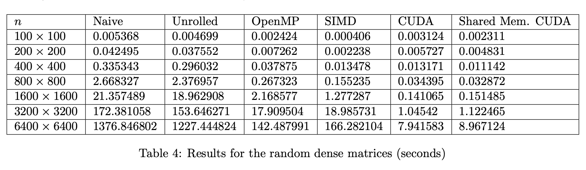

# Matrix-Inversion

Final Project for High Performance and Parallel Computing.

Investigates how quickly Matrix Inversion can be accomplished using the Gauss Jordan method with the following:

- Intel SIMD (AVX-512 Instruction Set)
- OpenMP
- CUDA
- Unrolling
  
We also ran the program serially on the CPU.

The results can be seen below:

- Dense Matrix:
        

- Sparse Matrix:
        
    
